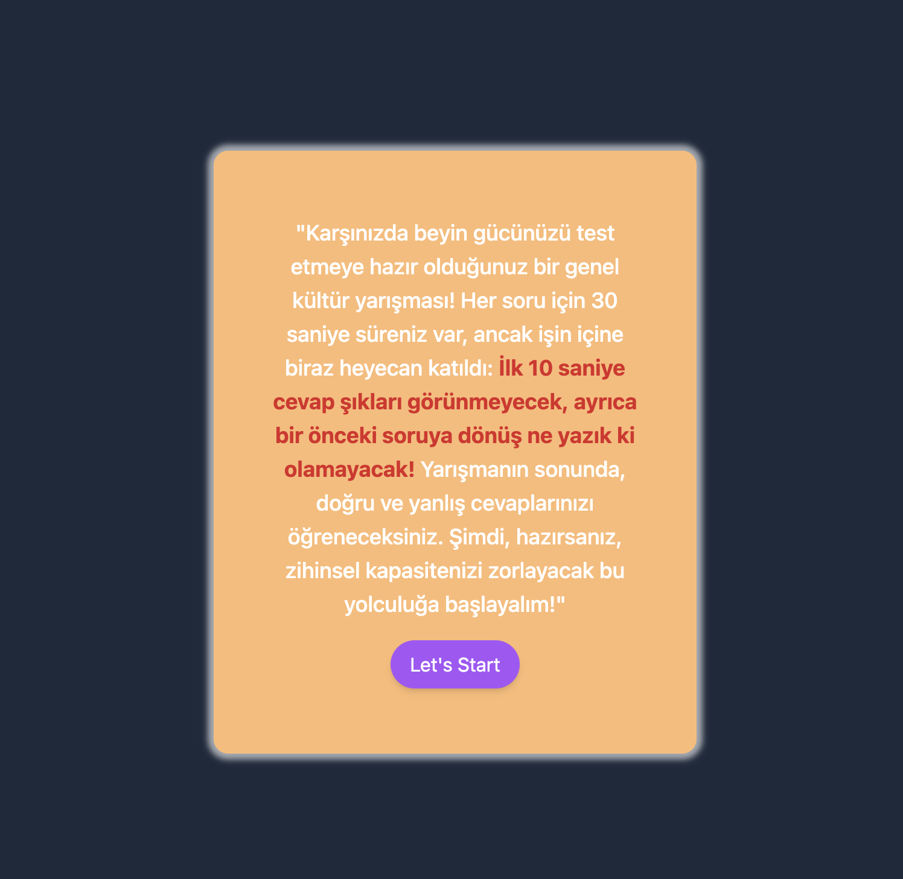
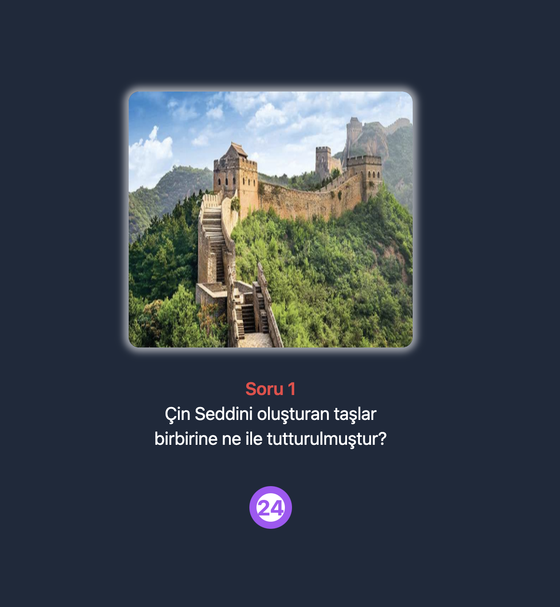
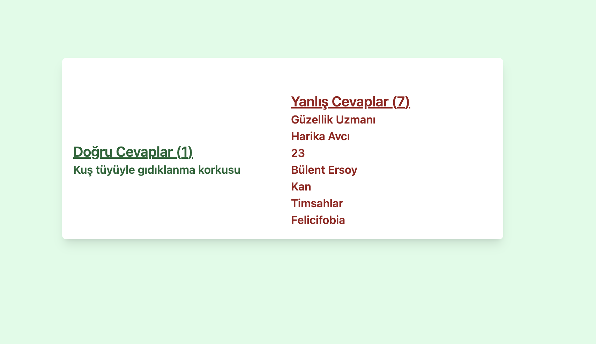

# React + Vite

---

# Question App

`Vercel canlı site adresi:` https://question-app-bay.vercel.app/

Bu, kullanıcıların genel kültürlerini test etmek için bir quiz uygulaması olan bir React + Vite uygulamasıdır. Uygulama, her soru için bir zamanlayıcı, seçenekler ve doğru ve yanlış cevaplar için geri bildirim sağlar.(css için : Tailwind )

## Bileşenler

### 1. Başlangıç Ekranı

`StartScreen` bileşeni, quiz'in başlangıç ekranını oluşturur. Kullanıcılara quiz kuralları hakkında bir genel bakış sunar ve quiz'e başlamalarını sağlar.

#### Props

- `onStart`: Quiz'in başlatılmasını yöneten bir fonksiyon.

### 2. Soru

`Question` bileşeni, quiz sırasında her bir soruyu gösterir. Soruyu, seçenekleri ve her soru için bir zamanlayıcıyı içerir.

#### Props

- `question`: Şu anki soru nesnesi.
- `selectedOption`: Kullanıcı tarafından seçilen seçenek.
- `setSelectedOption`: Seçilen seçeneği ayarlayan bir fonksiyon.
- `isOptionsOpen`: Seçeneklerin görünürlüğünü belirten bir boolean değeri.
- `setIsOptionsOpen`: Seçeneklerin görünürlüğünü açıp kapatan bir fonksiyon.
- `questionIndex`: Şu anki sorunun dizin numarası.
- `setQuestionIndex`: Şu anki sorunun dizin numarasını ayarlayan bir fonksiyon.
- `questions`: Tüm soruların bir dizisi.
- `setIsFinishScreenOpen`: Bitiş ekranının görünürlüğünü açıp kapatan bir fonksiyon.
- `correctQuestions`: Doğru cevaplanan soruları depolamak için bir dizi.
- `setCorrectQuestions`: Doğru cevaplanan soruları güncelleyen bir fonksiyon.
- `wrongQuestions`: Yanlış cevaplanan soruları depolamak için bir dizi.
- `setWrongQuestions`: Yanlış cevaplanan soruları güncelleyen bir fonksiyon.

### 3. Seçenekler

`Options` bileşeni, şu anki soru için seçenekleri gösterir ve kullanıcı seçimlerini yönetir.

#### Props

- `question`: Şu anki soru nesnesi.
- `selectedOption`: Kullanıcı tarafından seçilen seçenek.
- `setSelectedOption`: Seçilen seçeneği ayarlayan bir fonksiyon.
- `questionIndex`: Şu anki sorunun dizin numarası.
- `setQuestionIndex`: Şu anki sorunun dizin numarasını ayarlayan bir fonksiyon.
- `setIsOptionsOpen`: Seçeneklerin görünürlüğünü açıp kapatan bir fonksiyon.
- `questions`: Tüm soruların bir dizisi.
- `setIsFinishScreenOpen`: Bitiş ekranının görünürlüğünü açıp kapatan bir fonksiyon.
- `correctQuestions`: Doğru cevaplanan soruları depolamak için bir dizi.
- `setCorrectQuestions`: Doğru cevaplanan soruları güncelleyen bir fonksiyon.
- `wrongQuestions`: Yanlış cevaplanan soruları depolamak için bir dizi.
- `setWrongQuestions`: Yanlış cevaplanan soruları güncelleyen bir fonksiyon.

### 4. Zaman Sayacı

`TimeCount` bileşeni, her bir soru için geri sayım zamanlayıcısını gösterir.

#### Props

- `questionIndex`: Şu anki sorunun dizin numarası.

### 5. Bitiş Ekranı

`FinishScreen` bileşeni, quiz sonuçlarını doğru ve yanlış cevaplar olarak gösterir.

#### Props

- `correctQuestions`: Doğru cevaplanan soruların bir dizisi.
- `wrongQuestions`: Yanlış cevaplanan soruların bir dizisi.

## Kullanım

Bu uygulamayı kullanmak için aşağıdaki adımları izleyin:

1. Depoyu klonlayın.
2. Bağımlılıkları `npm install` kullanarak yükleyin.
3. Geliştirme sunucusunu `npm run dev` ile başlatın.
4. Tarayıcınızda `örneğin : http://localhost:5173` adresinden uygulamaya erişin.

## Katkıda Bulunma

Katkılarınızı bekliyoruz! Herhangi bir hata bulursanız veya iyileştirmeler için önerileriniz varsa, lütfen bir sorun açın veya bir pull isteği gönderin.

## Lisans

Bu proje [MIT Lisansı](LICENSE) ile lisanslanmıştır.

---
